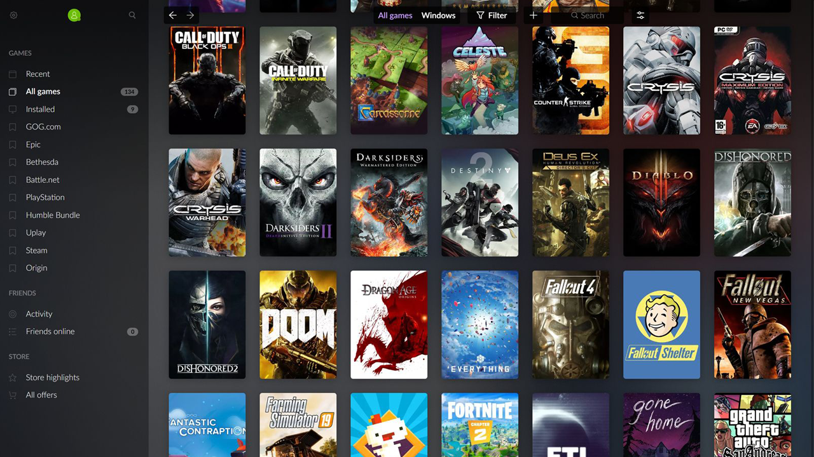

# Game Library

A game library made using [Rawg API](https://rawg.io/apidocs)

## Mission
Your client would like to have their own **_video game_** website. A website that they could use to see all up-coming video games, and all existing video games on diverse platforms. **They don't have the budget for a designer**, and gave you some **_images they found on the Internet_** to give you and idea of look and feel of the site.
They completely trust you and think you are capable enough as a front-end developer to come up with your own touch while following the feel of the pictures.

## Tech used in the project

- Vite
- React
- Sass
